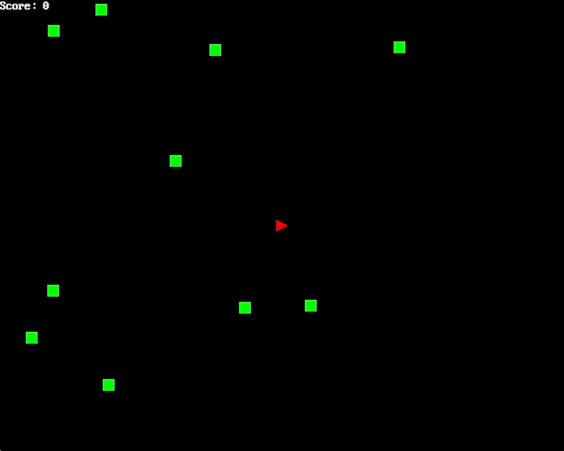

## defender

This is a very basic 2D game that I built in order to learn and build
a somewhat complex program with Rust.

You can check out my write-up of the experience here:
https://a5huynh.github.io/posts/2018/adventures-in-rust/

The version that was developed for that blog post is tagged as [v0.1.0](https://github.com/a5huynh/defender-game/releases/tag/0.1.0)

### Running the Game

Currently there's no packaging to make it easy for non-devs to run the game
on their machines. So to get started with this example, you'll need to have
rust installed and run the following:

    cargo run

### Controls

Key         | Action
------------|--------------------------------
Arrow keys  | Move space ship.
Space       | Fire bullets.
Enter       | Restart game if you died/won.
Esc         | Exit the game.
